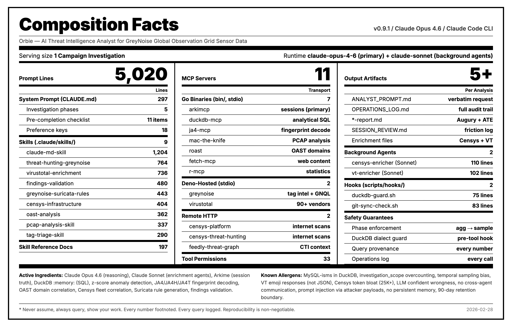

# Orbie [un]prompted

> **©️ Orbie** — The Orbie name, image, and likeness are © and ™ [GreyNoise Intelligence, Inc.](https://www.greynoise.io/) All rights reserved. Use without explicit written permission is prohibited.

## Reports

- [OAST Reports Orbie blogged on its own
](https://www.labs.greynoise.io/grimoire/index.html#category=OAST)

### [Campaign Analysis: Next.js Server Actions Exploitation & gs-netcat C2 Deployment](campaign-analysis-nextjs-server-actions-exploitation-and-gs-netcat-c2-deployment-from-457718857.pdf)

Comprehensive analysis of a sustained single-IP exploitation campaign from 45.77.188.57 (AS20473/Vultr) targeting Next.js Server Actions endpoints via HTTP POST with double base64-encoded shell payloads. Over 78 days (Dec 2025–Feb 2026), the actor conducted 143 sessions across 19 countries, deploying gs-netcat (Global Socket) reverse shells, injecting SSH authorized keys, and profiling compromised hosts for botnet enrollment using the Assetnote/1.0.0 scanning framework. Four distinct payload variants were identified, employing binary renaming and `/dev/shm/` tmpfs staging for evasion.

### [Campaign Analysis: SonicSiege — Multi-Vector SonicWall Reconnaissance and Credential Campaign](campaign-analysis-sonicsiege-multi-vector-sonicwall-reconnaissance-and-credential-campaign.pdf)

Analysis of a massive coordinated scanning campaign targeting SonicWall SonicOS infrastructure observed Feb 22–25, 2026. 80,770 sessions from 6,620 unique IPs across 60 ASNs, organized into three operational tiers: a 4,106-IP commercial proxy spray via ByteZero/GoCodeIT exit nodes on AS3257/GTT (45% of volume), concentrated scanning clusters in Eastern European ASNs (36%), and distributed opportunistic scanners (~19%). The campaign was overwhelmingly reconnaissance and credential-oriented, with the `/sonicui/7/login/` management path emerging as a newly significant attack surface.

### [Censys Infrastructure Enrichment](censys-infrastructure-enrichment.pdf)

Infrastructure enrichment report for 22 IPs associated with a Java C2 beacon campaign using HTTP PUT to randomized `.session` paths (Dec 2025–Feb 2026). Censys data reveals a mixed-origin fleet: operator-controlled nodes sharing a common HASSH fingerprint across FlokiNET, Oracle Cloud, and Czech ISPs; residential/mobile endpoints in Iran, Sri Lanka, and Algeria likely serving as compromised relays; ephemeral cloud VMs on Azure and Oracle; and a Cloudflare anycast IP suggesting possible domain-fronting C2 evasion. Includes per-IP service details, SSH keys, JARM fingerprints, and CVE exposure.

### [OAST Domain Analysis: CVE-2025-24813 Campaign](oast-domain-analysis-cve-2025-24813-campaign.pdf)

Deep-dive analysis of Out-of-band Application Security Testing (OAST) domains extracted from a CVE-2025-24813 mass exploitation campaign (58 sessions, 22 source IPs). OAST callback domains were embedded inside Java serialized payloads and could only be recovered via PCAP file carving rather than indexed Arkime fields. The report documents a clear temporal phase transition around Jan 22–27, 2026 from public Interactsh OAST infrastructure to private/self-hosted instances, indicating operational maturity progression by the threat actors.

### [Tag Activity Triage Report](tag-activity-triage-report.pdf)

Automated overnight triage report covering GreyNoise tag activity from Feb 18–19, 2026 against a 14-day baseline. Analyzes 2,508 tags (2,120 malicious, 339 suspicious, 49 unknown) and surfaces statistically significant activity spikes using z-score analysis. Notable surges include Samsung MagicINFO CVE-2024-7399 path traversal attempts (+16,967%, 86σ), Netgear SOHO router crawling (+6,578%, 80σ), ZTE router worm activity (+2,631%, 21σ), and Sophos XG Firewall user portal scanning (+272%, 17σ).

## AI Skills

### [Censys Infrastructure Enrichment](censys-infrastructure-enrichment/)

An AI skill (structured prompt + reference docs + helper scripts) for automated infrastructure profiling using [Censys](https://censys.io/) internet-wide scanning data via [Censys MCP servers](https://github.com/censys/censys-mcp). Point it at a list of IPs, ASNs, domains, or CVEs and it will query Censys, parse the flattened response format, correlate fleet-level patterns (shared SSH keys, HASSH fingerprints, identical service configurations, scan-only nodes), and produce a structured enrichment report. Includes a Python response parser, a bash field-extraction script, CenQL query pattern references, and report integration templates. Operates in full standalone mode or as a lightweight subtask within a larger analysis workflow.

## Tools

### [roast](https://codeberg.org/hrbrmstr/go-roast)

A Go library, CLI tool, and stdio MCP server for decoding and analyzing Interactsh OAST (Out-of-band Application Security Testing) domains. OAST callbacks are a staple of modern vulnerability scanning — every Interactsh domain encodes a 12-byte XID preamble containing a timestamp, machine ID, process ID, and counter that can be used to correlate scanning campaigns, attribute activity to specific tooling, and track threat actor infrastructure over time. `roast` extracts and decodes that metadata from raw domains, log files, or PCAPs, and can perform full campaign analysis (grouping by machine ID, identifying time spans, and surfacing counter progressions). It ships with live-fetching of 868+ known OAST domain suffixes (Interactsh + Burp Collaborator) from [darses/cti](https://github.com/darses/cti), intelligent caching, and an attribution engine that distinguishes legitimate security vendors (NetSPI, Rapid7) from unknown infrastructure. Inspired by John Jarocki's LabsCon talk ["Tracking the cyberspace ghost from OAST to OAST"](https://drive.proton.me/urls/ACAEQN0HB4#wfhmFCMfc4Os).

The MCP server mode (`roast mcp`) exposes decode, extract, validate, and campaign-analysis tools plus an `oast-expert` prompt and live domain intelligence resources — drop it into any MCP-capable client (Claude Desktop, etc.) for interactive OAST analysis. MIT licensed.
